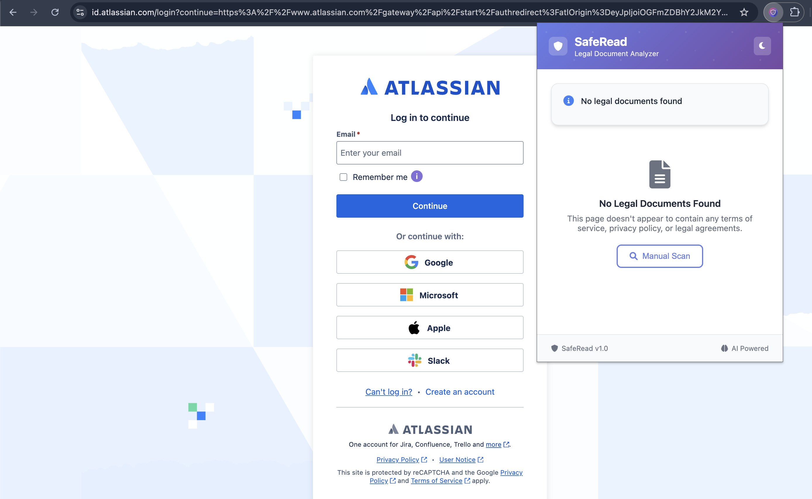
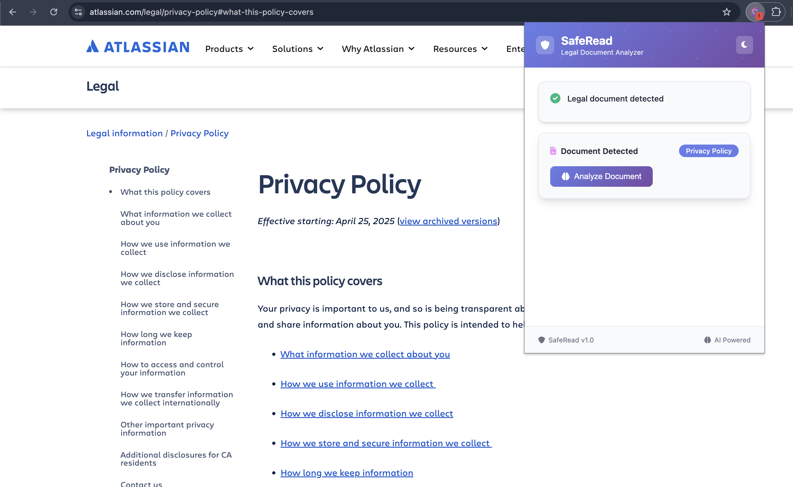
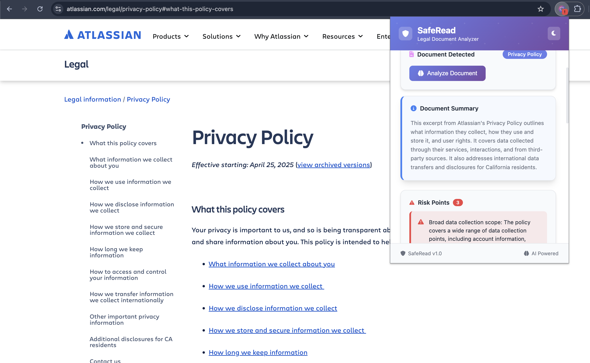

# SafeRead Chrome Extension

A Chrome extension that automatically detects and analyzes legal documents, terms of service, privacy policies, and other legal agreements on web pages using AI-powered analysis.

## Features

- 🔍 **Automatic Detection**: Automatically detects legal documents on web pages
- 🤖 **AI Analysis**: Analyzes documents using a local API for privacy
- ⚠️ **Risk Assessment**: Highlights risky clauses and terms
- ✅ **Favorable Points**: Identifies user-friendly terms
- 📊 **Smart Summary**: Provides concise document summaries
- 🌙 **Dark/Light Theme**: Modern UI with theme switching
- 🔔 **Visual Indicators**: Badge notifications for detected documents

## Screenshots

### Extension Popup Interface


### Analysis Results View


### Theme Switching


## Installation

### Method 1: Load Unpacked Extension (Development)

1. Clone or download this repository
2. Open Chrome and go to `chrome://extensions/`
3. Enable "Developer mode" (toggle in top right)
4. Click "Load unpacked" and select the extension directory
5. The SafeRead extension should now appear in your extensions list

### Method 2: From ZIP File

1. Download the extension as a ZIP file
2. Extract to a folder on your computer
3. Follow Method 1 steps 2-5

## Setup Requirements

### API Server
This extension requires a local API server running on `http://localhost:8000`. The server should have an endpoint at `/scanner/quick-analyze/` that accepts POST requests with the following format:

**Request:**
```json
{
  "content": "string",
  "document_type": "legal"
}
```

**Response:**
```json
{
  "short_summary": "Document summary here...",
  "risky_points": [
    "Risk point 1",
    "Risk point 2"
  ],
  "favourable_points": [
    "Favorable point 1",
    "Favorable point 2"
  ]
}
```

**Supported Document Types:**
- `terms` - Terms & Conditions
- `privacy` - Privacy Policy
- `legal` - Legal Agreement
- `other` - Other Document

## Usage

1. **Automatic Detection**: Navigate to any webpage with legal documents. The extension will automatically detect them and show a badge.

2. **Manual Analysis**: Click the SafeRead icon in the toolbar to open the popup.


3. **View Results**: If a legal document is detected, click "Analyze" to get AI-powered insights.


4. **Review Points**: The extension will show:
   - **Summary**: A concise overview of the document
   - **Risk Points**: Potentially problematic clauses highlighted in red
   - **Favorable Points**: User-friendly terms highlighted in green

## Document Detection

The extension detects legal documents by:
- Analyzing page URLs for legal-related paths
- Scanning page content for legal keywords
- Checking page titles for legal terminology
- Looking for common legal document patterns

## Privacy

- All document analysis is performed locally through your specified API
- No data is sent to external servers
- Content is only processed when you explicitly click "Analyze"
- Theme preferences are stored locally in Chrome storage

## UI Features

- **Modern Design**: Clean, professional interface using DaisyUI
- **Theme Toggle**: Switch between light and dark themes
- **Responsive Layout**: Optimized for Chrome extension popup
- **Loading States**: Clear feedback during analysis
- **Error Handling**: Graceful error messages and retry options
- **Visual Indicators**: Color-coded risk and favorable points


## File Structure

```
saferead_chrome/
├── manifest.json          # Extension manifest
├── popup.html             # Extension popup UI
├── popup.js               # Popup functionality
├── content.js             # Content script for page analysis
├── background.js          # Background service worker
├── icons/                 # Extension icons
│   ├── icon.svg
│   ├── icon16.png
│   ├── icon48.png
│   └── icon128.png
└── README.md              # This file
```

## Development

### Making Changes

1. Edit the relevant files
2. Go to `chrome://extensions/`
3. Click the refresh icon on the SafeRead extension
4. Test your changes

### Debugging

- **Popup Issues**: Right-click the extension icon and select "Inspect popup"
- **Content Script Issues**: Open DevTools on the webpage and check console
- **Background Script Issues**: Go to `chrome://extensions/` and click "Service Worker" link

## Permissions

The extension requires the following permissions:
- `activeTab`: To access content of the current tab
- `scripting`: To inject content scripts
- `storage`: To save theme preferences and analysis cache
- `host_permissions`: To communicate with the local API server

## Troubleshooting

### Common Issues

1. **"No legal documents found"**: The page might not contain detectable legal content, or the detection keywords might need adjustment.

2. **"Analysis failed"**: Check if your API server is running on `http://localhost:8000` and the endpoint is accessible.

3. **"Network error"**: Ensure your API server is running and CORS is properly configured.

4. **Extension not loading**: Make sure you're in Developer mode and the manifest.json file is valid.

### FAQ

**Q: Why is the extension not detecting legal documents?**
A: The extension uses keyword matching and URL patterns. Some legal documents might use different terminology or be embedded in complex page structures.

**Q: Can I customize the detection keywords?**
A: Yes, you can modify the `legalKeywords` object in `content.js` to add or remove detection terms.

**Q: How can I change the API endpoint?**
A: Modify the `API_URL` constant in `background.js` to point to your API server.

**Q: Is my data secure?**
A: Yes, all analysis is performed through your local API server. No data is sent to external services.

## Contributing

Feel free to submit issues and pull requests to improve the extension.

## License

This project is open source and available under the [MIT License](LICENSE).
